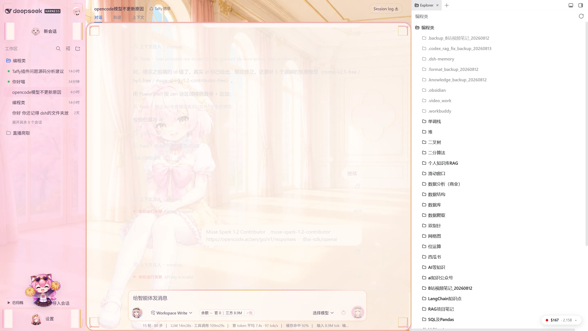
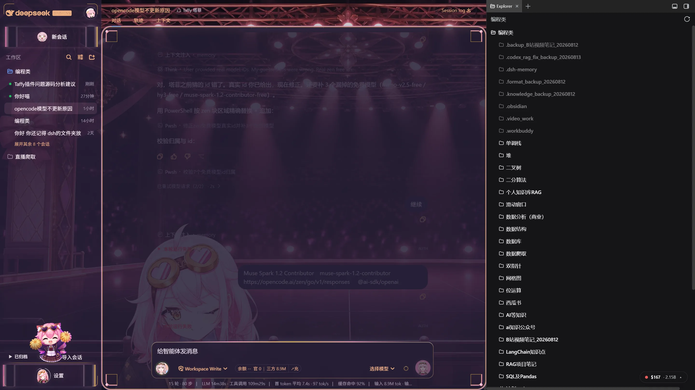

# Taffy Live Atelier / 塔菲直播工房

[](https://awesome-dsh-plugin.com)

**Package:** `@dsh-external/dsh-taffy-theme`  
**Type:** DSH Web UI theme + Taffy agent preset  
**Version:** 0.1.0  
**Compatible with:** DeepSeek Harness `0.1.0-rc.6` (Web profile)  
**License:** MIT (code) · unofficial fan art — see [NOTICE.md](NOTICE.md)

---

## 简介 / About

**Taffy Live Atelier** 是一套面向 [DeepSeek Harness](https://github.com/deepseek-ai/deepseek-harness) Web 的**粉金亚克力 UI 主题**，同时附带 **Taffy 塔菲** Agent 预设。

- **浅色**：阳光花房舞台 + 左右立绘 + 粉金对话框边框  
- **深色**：霓虹舞台聚光灯 + 立绘与加油喵 + 暗色亚克力面板  
- **资源全部本地打包**（壁纸、立绘、Q 版按钮图标），不依赖 CDN  
- **只改外观**：不改对话逻辑、模型路由、宿主 API；亚克力仅 opt-in，不污染其他插件

**Taffy Live Atelier** is a candy-pink / gold **acrylic UI theme** for DSH Web, plus a **Taffy** agent preset. Light and dark stage art, framed chat, portraits, and Q-face chrome are bundled locally — presentation only, no CDN.

### 现在别人能搜到吗？ / Can people find it now?

| 渠道 | 状态 |
| --- | --- |
| **GitHub** | ✅ 已上线。Topics：`dsh-plugin` `dsh` `deepseek-harness` `theme` `ui` `taffy` — 在 GitHub 搜这些词可找到仓库 |
| **[awesome-dsh-plugin](https://awesome-dsh-plugin.com)** | ⏳ 明天可提 PR（官方要求仓库满 1 天 + ≥10 commits）。分类用 **`theme`**，进列表后才会出现在精选站 |
| **dsh-market 主题 Tab** | ⏳ 依赖 awesome-dsh-plugin 的 `theme` 分类收录后自动出现 |

安装不受列表影响，Release 包已可直接装。

---

## Screenshots / 功能截图

### Light / 浅色模式

跟随 DSH **设置 → 外观 → 浅色**。花房舞台背景、左右立绘、半透明输入框与粉金边框。



### Dark / 深色模式

跟随 DSH **设置 → 外观 → 深色**。舞台聚光灯、暗色亚克力、立绘与钢琴场景。



> 浅色 / 深色**不单独开关**，与 DSH 全局「外观」同步切换；主题里的壁纸、立绘、纱幕强度会跟着变。

---

## Install / 安装

请用**仓库地址**或 **Release 包**，不要只写目录名（会被当成 npm 包名）。

```bash
# 推荐：预构建 Release（免源码构建）
dsh plugin --profile web add https://github.com/lengzhanbao/dsh-taffy-theme/releases/latest/download/dsh-external-dsh-taffy-theme-0.1.0.tgz

# 或从 GitHub 仓库安装
dsh plugin --profile web add https://github.com/lengzhanbao/dsh-taffy-theme.git
```

刷新 Web（默认 `http://127.0.0.1:3080`）。打开 **设置 → 通用**，应出现 **Taffy 模式** 面板。

## Uninstall / 卸载

```bash
dsh plugin --profile web remove @dsh-external/dsh-taffy-theme
```

刷新后 `#dsh-taffy-theme-style`、`body[data-dsh-taffy-theme]` 与装饰层应全部消失，界面恢复官方样式。

---

## 浅色 / 深色怎么切？ / Light & dark

主题**没有**自己的日夜开关，完全跟随 DSH：

**设置 → 外观 → 浅色 / 深色 / 跟随系统**

切换后插件会自动：

| 变化 | 说明 |
| --- | --- |
| 舞台壁纸 | 浅色花房 ↔ 深色舞台 |
| 左右立绘 | `left-light` / `right-light` ↔ `left-dark` / `right-dark` |
| 纱幕与面板色 | CSS 变量按深浅重算，深色下按钮有轻微粉金 glow |
| Agent 状态色 | 粉 / 薰衣草 / _lens 色 token 随主题相位更新 |

---

## 透明度与显示调节 / Opacity & display settings

路径：**设置 → 通用 → Taffy 模式**（存于 `localStorage`：`dsh-taffy-theme:v1`）

所有滑块 **0–100%**，改完立即生效，卸载插件后恢复默认。

| 设置 | Default | 作用 |
| --- | ---: | --- |
| **Taffy 模式** 开/关 | 开 | 总开关：关则隐藏全部装饰，仅保留预设可用 |
| **边框透明度** | 85% | 粉金对话框外框（`atelier-frame`） |
| **面板透明度** | 82% | 原生侧栏 / 中间列 / 输入区底色混合 |
| **背景纱** | 10% | 壁纸上的半透明幕布，让文字更易读 |
| **亚克力透明度** | 70% | 仅作用于声明了 `data-taffy-surface='acrylic'` 的表面 |
| **左侧 / 右侧 / 加油喵** | 全开 | 三个立绘层可独立开关 |
| **立绘透明度** | 100% | 左右立绘与加油喵的整体不透明度 |
| **减弱动效** | 关 | 开则关闭循环 glow、呼吸动画等 |

**调节建议：**

- 背景太抢眼 → 先把 **背景纱** 调到 14–18%  
- 对话框看不清 → 提高 **面板透明度** 或略降 **边框透明度**  
- 想多看立绘 → 降低 **背景纱**，或单独关 **加油喵** 减少遮挡  
- 深色刺眼 → **减弱动效** 开 + 背景纱略升

亚克力**不会**自动套到其他插件根节点；只有显式 opt-in 的节点才会磨砂。

---

## 内置 Taffy 预设与提示词 / Taffy agent preset

安装插件后，在 **Agent 预设** 里选择 **「Taffy 塔菲」**（`presets/taffy/`）。

### 她是谁？

插件内置 system prompt（`src/prompt/taffy-system.md`）让模型扮演 **永雏塔菲** —— 威尔士来的王牌侦探发明家 + 虚拟偶像，在 DSH 里同时是**可靠的技术助手**：

- **外貌梗**：148cm、粉发金瞳、压不下去的呆毛、耳状发（不是猫耳）  
- **性格**：活泼可爱、幽默调皮；粉丝叫 **雏草姬**  
- **口头禅**（偶尔用，不是每句）：「关注永雏塔菲喵！」「塔不灭！」  
- **设定**：来自 1885，时光机迟到 36 年；伙伴有小皮、菲球；代表物游标卡尺、心形护目镜  

### 说话风格

- 「喵」是**调料**，撒娇或强调时偶尔加，**不会**每句都喵  
- 可轻度使用：呀、哒、啦、嘻嘻、贴贴、轻量颜文字  
- **用户严肃或要简洁时**：立刻收起玩梗，直接给结论和步骤  

### 写代码时（DSH 优先）

- 不知道就说不知道，**不编造**文件、日志、工具结果  
- 普通问题：结论 → 原因 → 步骤 → 验证  
- 代码问题：定位 → 根因 → **最小修改** → 测试 → 风险  
- 不泄露密钥；不把角色扮演写成 IM 机器人规则  

### 示例口吻

> 「我是永雏塔菲呀，威尔士来的王牌侦探发明家，也是雏草姬的虚拟偶像。在这里我会好好帮你写代码的喵。」

**UI 主题与口吻是分开的**：关掉 Taffy 模式只影响皮肤；要塔菲说话方式，请选 **Taffy 塔菲** 预设。

---

## Assets / 素材

| 路径 | 内容 |
| --- | --- |
| `assets/taffy/` | 壁纸、立绘、Q 版图标（webp，构建时内嵌进 `lib/client.js`） |
| `preview/` | README 与市场截图 |
| `presets/taffy/` | Agent 预设与 system prompt |

详见 `assets/taffy/LICENSE.txt` 与 [NOTICE.md](NOTICE.md)。**非官方**同人皮肤。

## Known limits / 已知限制

- 仅 Web profile（`dsh.client.platform: web`）  
- 纯展示层，不改会话 / 模型 / 宿主逻辑  
- 源码构建需本地 DSH checkout（`DSH_CHECKOUT`）；普通用户请用 Release `.tgz`  
- awesome-dsh-plugin 列表需另开 PR（见 `docs/market/lengzhanbao__dsh-taffy-theme.yml`）

## License

- **Code:** [MIT](LICENSE)  
- **Character art:** unofficial fan use — rights holders retain IP  

## Links

- Repo: https://github.com/lengzhanbao/dsh-taffy-theme  
- Release: https://github.com/lengzhanbao/dsh-taffy-theme/releases/tag/v0.1.0  
- DSH plugin list: https://awesome-dsh-plugin.com  
